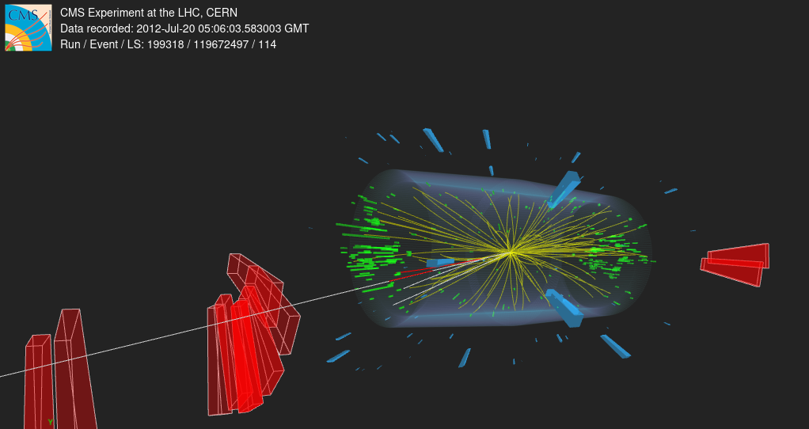

# Physics Background: $H \to ZZ^* \to 4\mu$

Theoretical physics context, kinematic derivation, and decay selection logic for the Higgs boson invariant mass reconstruction using CERN CMS Open Data.

---

## The Higgs Field & Mass Generation

In the Standard Model, fundamental particles acquire mass by interacting with the scalar **Higgs field** through spontaneous electroweak symmetry breaking.

The **Higgs boson ($H$)** is the scalar quantum excitation of this field, discovered in 2012 by CMS and ATLAS with a rest mass of:

$$m_H \approx 125.1 \text{ GeV/c}^2$$

With a lifetime of $\sim 10^{-22}\text{ s}$, it decays instantly at the collision vertex. It cannot be directly tracked; its existence is inferred from stable decay products.

---

## The Golden Decay Channel: $H \to ZZ^* \to 4\mu$

The analysis focuses on the decay into two $Z$ bosons, which each decay into opposite-sign muon pairs:

$$p + p \to H \to Z + Z^* \to (\mu^+ \mu^-) + (\mu^+ \mu^-)$$

- **Off-shell $Z^*$:** Since $m_H \approx 125\text{ GeV} < 2 \times m_Z$ ($m_Z \approx 91.2\text{ GeV}$), one $Z$ boson is produced on-shell (real mass) and the second off-shell ($Z^*$, virtual mass).
- **Why "Golden"?** Although the branching ratio is small ($\sim 0.012\%$), muons provide extremely clear tracks, high detector efficiency, and **zero missing energy** (no neutrinos), allowing complete kinematic reconstruction.

---

## Relativistic Kinematics

In special relativity, particle energy $E$ and momentum $\vec{p}$ form a four-momentum vector $P$:

$$P = (E, p_x, p_y, p_z)$$

The scalar product yields the invariant rest mass $m$:

$$P^2 = E^2 - \|\vec{p}\|^2 = m^2$$

By conservation of four-momentum, the parent Higgs mass is recovered from its four daughter muons:

$$P_H = \sum_{i=1}^4 P_{\mu_i} \implies m_{4\mu} = \sqrt{\left(\sum_{i=1}^4 E_i\right)^2 - \left\|\sum_{i=1}^4 \vec{p}_i\right\|^2}$$

---

## CMS Coordinate Conversion

CMS records particles in cylindrical coordinates ($p_T, \eta, \phi$). My code converts them into Cartesian components:

$$p_x = p_T \cos\phi \quad | \quad p_y = p_T \sin\phi$$

$$p_z = p_T \sinh\eta \quad | \quad E = \sqrt{p_x^2 + p_y^2 + p_z^2 + m_\mu^2}$$

*(where $m_\mu \approx 0.1057\text{ GeV/c}^2$)*

> 💡 **Why $m_{4\mu} \neq \sum m_\mu$:** Simply adding rest masses gives $4 \times 0.1057 \approx 0.42\text{ GeV}$. The remaining $\sim 124.58\text{ GeV}$ comes entirely from the **kinetic energy and angular separation** of the high-speed muons.

### 📸 CMS 3D Event Display (Real Collision Candidate)

Below is an actual proton-proton collision recorded by CMS on July 20, 2012 (Run 199318, Event 119672497). The long red vectors extending through the outer muon chambers represent high-momentum muons reconstructed by the spectrometer.

---

## Fitting Models Comparison

To extract the exact peak mass from the reconstructed spectrum, different mathematical models can be applied:

| Model | Purpose | Key Feature |
| :--- | :--- | :--- |
| **Binned Histogram** | Quick visualization | Fast, simple, sensitive to bin width |
| **Gaussian** | Basic peak resolution | Models simple detector noise |
| **Breit-Wigner** | Quantum physics | Models natural particle lifetime |
| **Crystal Ball** | **LHC Gold Standard** | Models photon energy loss (Bremsstrahlung) |

---

## LHC Higgs Detection Channels

| Channel | Branching Ratio | Main Advantage | Main Drawback |
| :--- | :--- | :--- | :--- |
| **$H \to 4\mu$** | **0.012%** | Ultra-clean signal, zero neutrinos | Rare occurrence |
| **$H \to \gamma\gamma$** | 0.23% | High energy resolution peak | High background |
| **$H \to WW^*$** | 21.5% | High event rate | Neutrinos blur mass peak |
| **$H \to b\bar{b}$** | **58.2%** | Most frequent decay | Huge QCD jet background |
